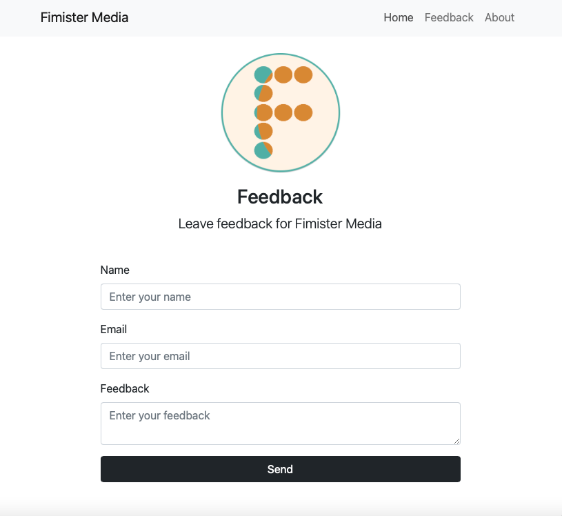
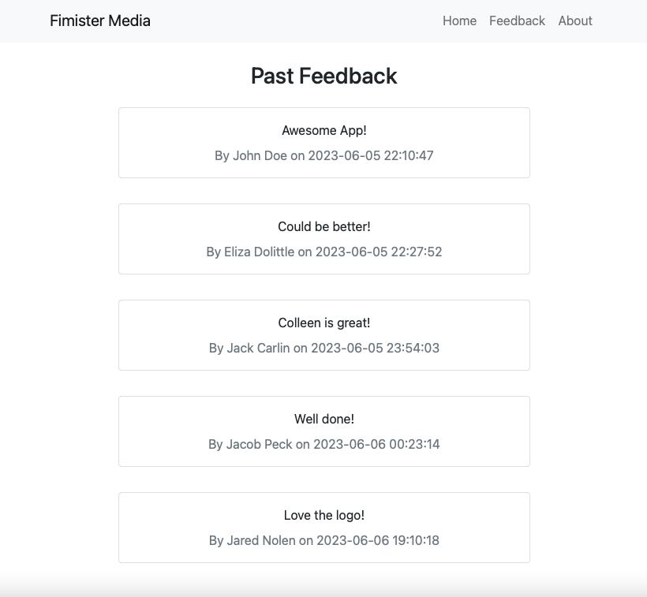
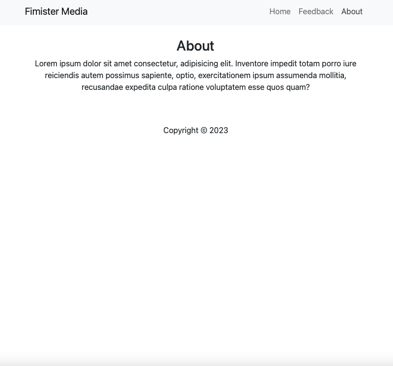
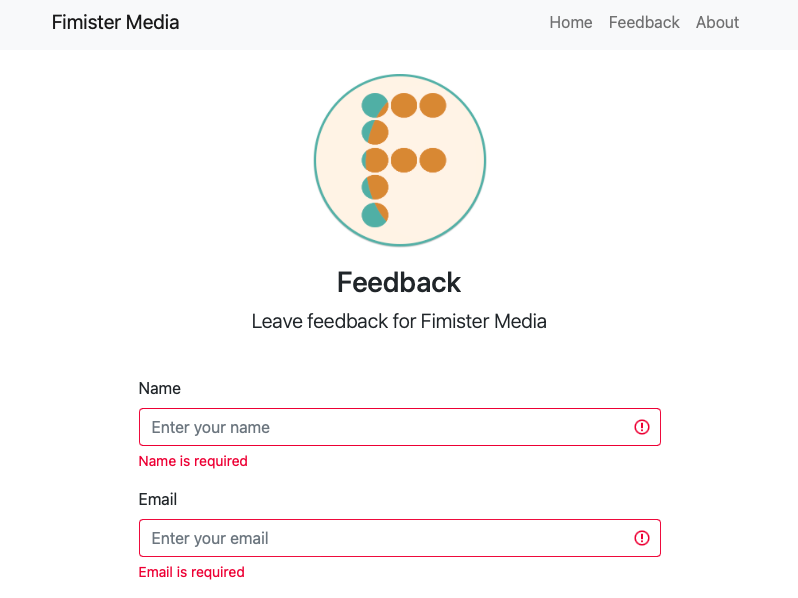
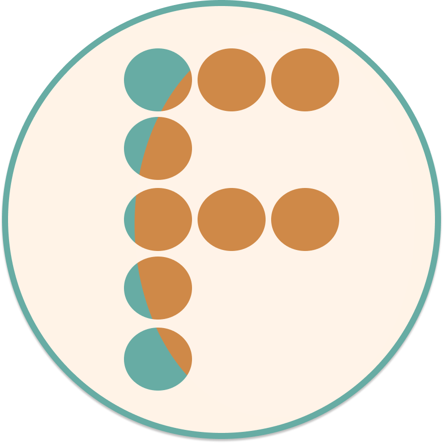

# PHP Feedback Application

## Description

This is a basic feedback application, which is part of a project to add a new language to my toolkit - PHP. I utilized the following tools and skills throughout this project: PHP, XAMMP (Apache + MariaDB + PHP + Perl), and Figma. I enjoyed experimenting with masks and components to make my logo in Figma. 

- [Installation](#installation)
- [Usage](#usage)
- [Credits](#credits)
- [License](#license)
- [Contributing](#contributing)
- [Links](#links)
- [Questions](#questions)

## User Story

```md
AS A user 
I WANT a feedback application
SO THAT I can leave feedback for Fimister Media
```

## Acceptance Criteria

```md
GIVEN an feedback application
WHEN I load the homepage
THEN I am presented with a page containing a header and a section for content
WHEN I view the header
THEN I am presented with the company name and options to navigate to Home, Feedback, or About pages
WHEN I click on the Home page
THEN I am presented with a home page with inputs for name, email, feedback, and send button
WHEN I enter the name, email, feedback
THEN I can click the send button and it will post to the feedback page
WHEN I DO NOT enter the name, email, or feedback
THEN I receive error messages that these are required to send feedback
WHEN I click on the feedback link
THEN I am presented with previous feedback on the feedback page
WHEN I click on the about link
THEN I am presented with the about page
```

## Installation

This is a webpage, so no installation is necessary.

## Usage

Please see below for examples of this application's usage and layout:











- https://www.figma.com/
- https://www.youtube.com/watch?v=BUCiSSyIGGU&ab_channel=TraversyMedia 
- https://coding-boot-camp.github.io/full-stack/github/professional-readme-guide

## License

[](https://opensource.org/licenses/MIT)<br/>

    MIT License

    Copyright (c) 2023 COLLEEN FIMISTER

    Permission is hereby granted, free of charge, to any person obtaining a copy
    of this software and associated documentation files (the "Software"), to deal
    in the Software without restriction, including without limitation the rights
    to use, copy, modify, merge, publish, distribute, sublicense, and/or sell
    copies of the Software, and to permit persons to whom the Software is
    furnished to do so, subject to the following conditions:

    The above copyright notice and this permission notice shall be included in all
    copies or substantial portions of the Software.

    THE SOFTWARE IS PROVIDED "AS IS", WITHOUT WARRANTY OF ANY KIND, EXPRESS OR
    IMPLIED, INCLUDING BUT NOT LIMITED TO THE WARRANTIES OF MERCHANTABILITY,
    FITNESS FOR A PARTICULAR PURPOSE AND NONINFRINGEMENT. IN NO EVENT SHALL THE
    AUTHORS OR COPYRIGHT HOLDERS BE LIABLE FOR ANY CLAIM, DAMAGES OR OTHER
    LIABILITY, WHETHER IN AN ACTION OF CONTRACT, TORT OR OTHERWISE, ARISING FROM,
    OUT OF OR IN CONNECTION WITH THE SOFTWARE OR THE USE OR OTHER DEALINGS IN THE
    SOFTWARE.

## Contributing

No contributions needed at this time, but please feel free to reach out to me at the email address below if you would like to contact me about this project.

## Links

[Live Link](https://feedback-php-app.herokuapp.com/)

[GitHub Link](https://github.com/carlincb/php-app)

## Questions

If you have questions, please contact us at carlin.colleen@gmail.com or find me at https://github.com/carlincb.